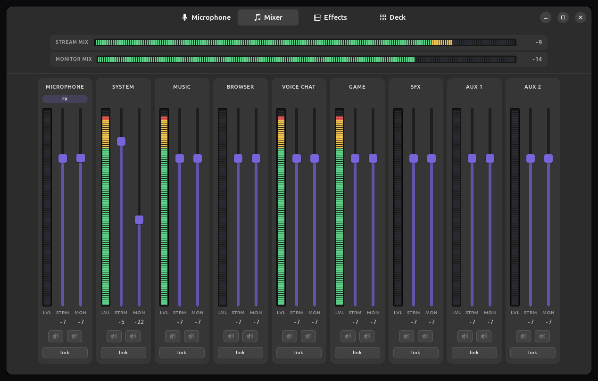
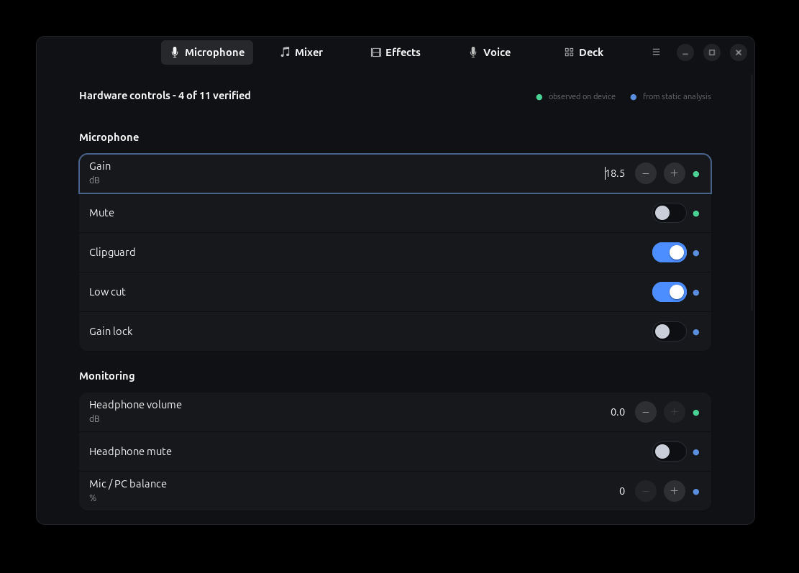
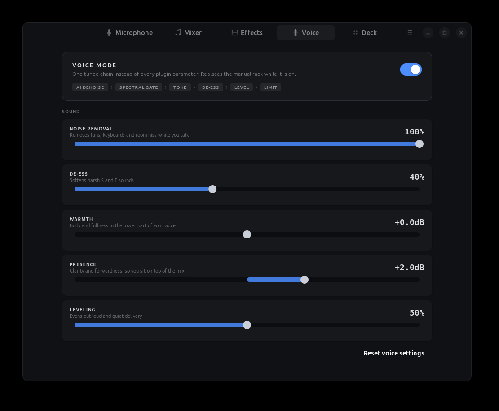
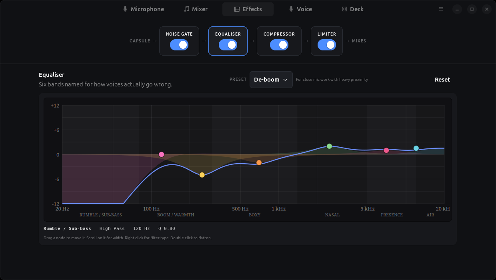
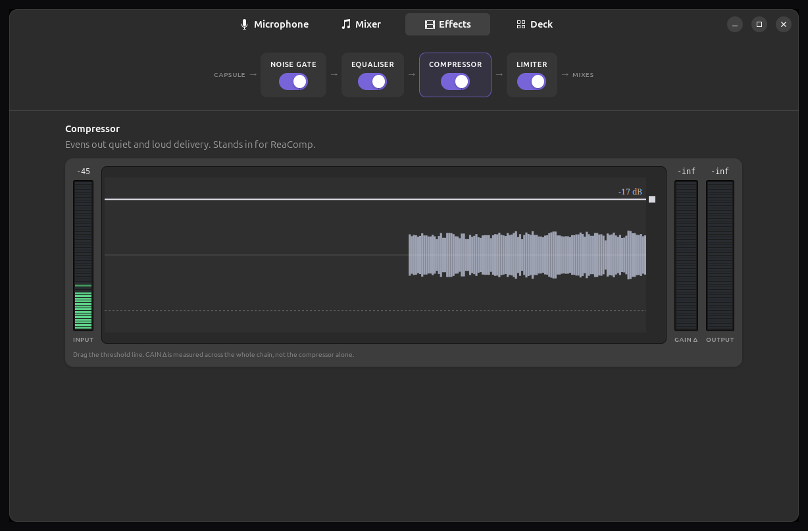
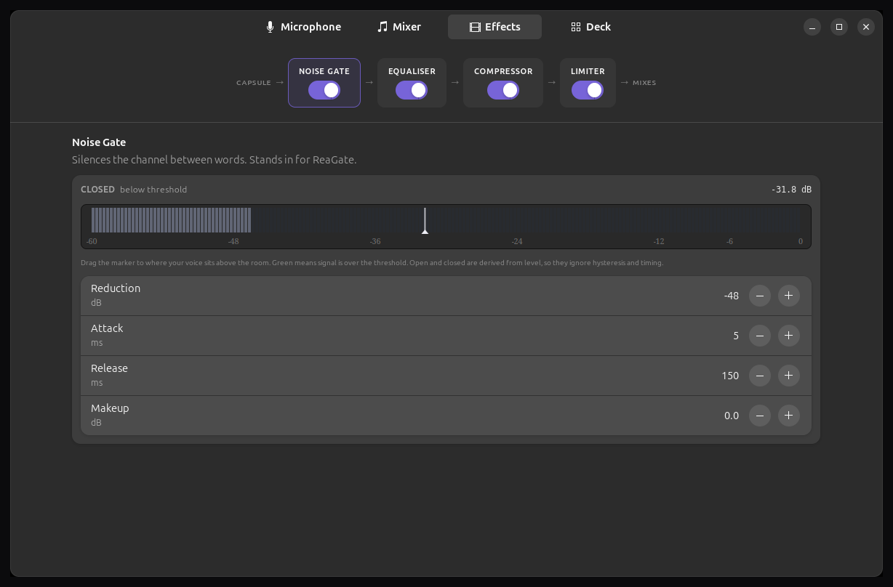
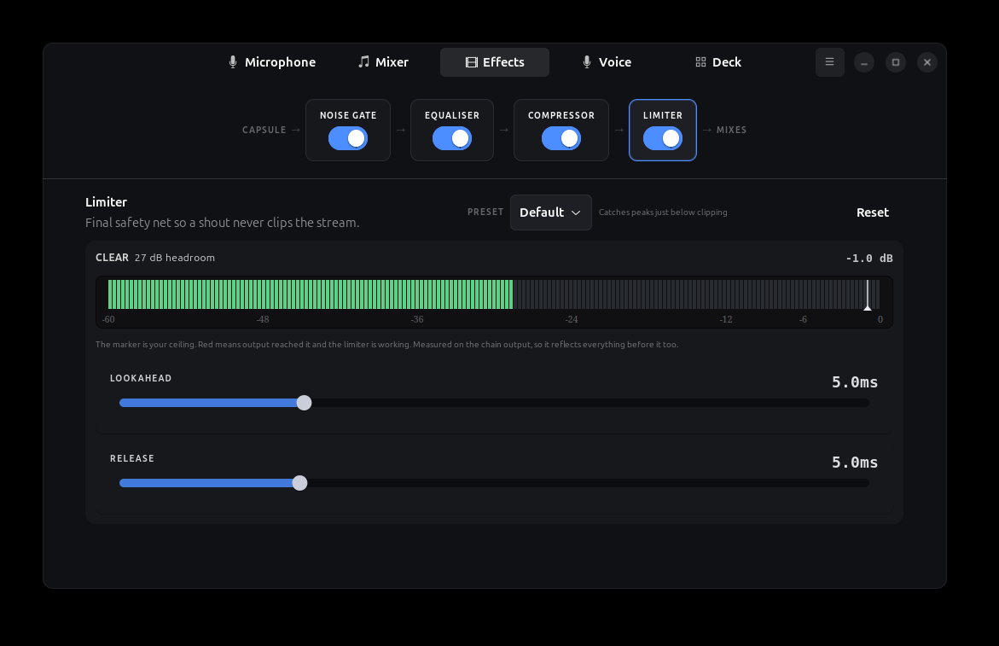
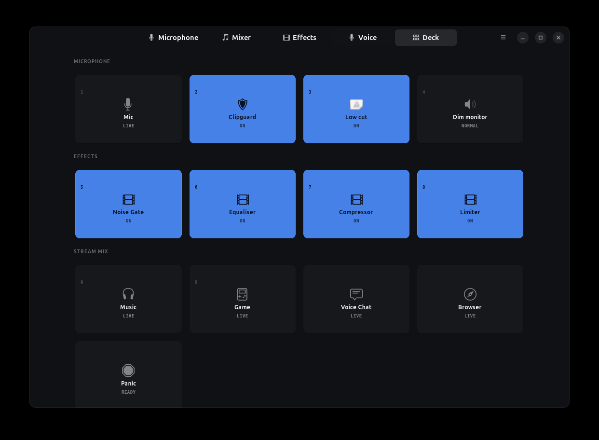

<div align="center">

# 🎙️ wave3

**Your Elgato Wave:3, working properly on Linux**

The mixer, the effects and the hardware controls that Wave Link keeps for Windows and macOS. Native GTK4, no Wine, no VM.

[](LICENSE)
[](https://python.org)
[](https://gtk.org)
[](https://gnome.pages.gitlab.gnome.org/libadwaita/)
[](https://pipewire.org)
[](https://lsp-plug.in)

<br>



</div>

---

## 👋 Hello

The Wave:3 is a lovely microphone, and on Linux you get about half of it. It works as a plain USB mic, but Clipguard, the low cut, the dial and the whole Stream/Monitor mixing idea all live in Wave Link, which Elgato only ships for Windows and macOS.

This is that other half, rebuilt as a Linux app. It talks to the microphone over the same USB protocol Wave Link uses, and it builds the mixer out of PipeWire.

If you record or stream on Linux and you own a Wave:3, this should feel like what you expected in the box.

## ✨ What you get

|  |  |
|---|---|
| 🎛️ **The real hardware controls** | Gain, mute, Clipguard, low cut, headphone volume, mic/PC balance, dial mode and the LED ring |
| 🎚️ **Two mixes, nine channels** | Every channel has one fader for your audience and another for your own headphones |
| 📊 **Meters you can trust** | Per-channel and per-bus peak meters with proper decay and peak hold |
| 🎨 **An EQ you can drag** | Six bands on Elgato's own frequency zones, recovered from Wave Link itself |
| 🔊 **Gate, compressor, limiter** | Running inside PipeWire, so there is no extra process and no added latency |
| 🎯 **Presets, and a way back** | Broadcast, Warm, Bright, Gentle and friends, with Reset on every effect |
| 🗣️ **Voice mode** | Five plain controls in front of a six-stage chain, when you would rather not think about DSP |
| ⚡ **A deck for live use** | Big tiles on number keys, including a one-press panic mute |
| 📹 **OBS ready** | Your stream mix shows up as an ordinary capture source |

## 🚀 Get started

Grab the `.deb` from [Releases](https://github.com/KailasMahavarkar/elgato-wave3-ubuntu/releases):

```bash
sudo apt install ./wave3_1.3.4_all.deb
```

Then set things up once:

```bash
systemctl --user restart wireplumber pipewire   # pick up the new rules
wave3 setup                                     # build the mixer and effects rack
wave3                                           # or launch it from your app menu
```

In OBS, add an **Audio Input Capture** and pick **Monitor of Wave:3 Stream Mix**. That is your finished mix.

> **Tip:** send apps to individual channels with `pavucontrol` (Playback tab), and each one gets its own pair of faders.

<details>
<summary><b>Installing from source instead</b></summary>

```bash
git clone https://github.com/KailasMahavarkar/elgato-wave3-ubuntu.git
cd elgato-wave3-ubuntu
sudo apt install python3-gi gir1.2-gtk-4.0 gir1.2-adw-1 \
                 lsp-plugins-ladspa pipewire-pulse
sudo make install-udev
```

Then run the same three setup commands above.

</details>

<details>
<summary><b>Adding AI noise suppression</b></summary>

```bash
sudo apt install git cmake build-essential
packaging/build-rnnoise.sh
```

RNNoise is GPL-3 and not packaged for Ubuntu, so it cannot ship inside the `.deb`. Voice mode looks for it at startup and falls back to a multiband spectral gate when it is missing.

</details>

## 📸 A look around

<table>
<tr>
<td width="50%"><br><b>Microphone</b> - the settings that live on the device itself</td>
<td width="50%"><br><b>Voice</b> - five sliders instead of thirty plugin parameters</td>
</tr>
<tr>
<td><br><b>Equaliser</b> - drag the dots. The curve you see is the curve you hear</td>
<td><br><b>Compressor</b> - drag the threshold against your own voice, then shape it with ratio, attack, release and makeup</td>
</tr>
<tr>
<td><br><b>Noise gate</b> - set the threshold against your actual room</td>
<td><br><b>Limiter</b> - a ceiling, so a laugh never clips the stream</td>
</tr>
<tr>
<td colspan="2"><br><b>Deck</b> - press 1 to 9 for the things you need in a hurry</td>
</tr>
</table>

## 🧩 How it works

Two paths, no proprietary driver:

```
  ┌────────────────┐   USB control transfers   ┌──────────────────┐
  │   wave3 app    │ ────────────────────────▶ │  Wave:3 firmware │   gain, mute,
  │                │ ◀──────────────────────── │                  │   clipguard, LEDs
  └───────┬────────┘        wIndex 0x3303      └──────────────────┘
          │
          │ builds and drives
          ▼
  ┌─────────────────────────────────────────────────────────────────┐
  │  PipeWire:  mic ▶ effects rack ▶ ┬▶ stream mix  ▶ OBS           │
  │             apps ▶ channels    ▶ ┴▶ monitor mix ▶ your phones   │
  └─────────────────────────────────────────────────────────────────┘
```

Every source fans out twice with an independent fader on each leg, which is why you can turn the game down in your headphones without your audience hearing any change. That asymmetry is the whole point of Wave Link.

Writes to the microphone are transactional. The app reads the config block, changes one field, writes it, reads it back, and puts the original block back if any other byte moved. The coloured dot on each row tells you whether that offset was confirmed on real hardware or recovered by analysis. The firmware-update interface is never touched.

**Want the details?** [`docs/ARCHITECTURE.md`](docs/ARCHITECTURE.md) has the full USB protocol, the PipeWire graph, the effects rack and the capture watchdog. The reverse-engineering notes live in [`research/dump/PROTOCOL.md`](research/dump/PROTOCOL.md).

## 🩺 If something seems off

```bash
wave3 doctor
```

It checks the capture stream, the USB control path and whether the topology is installed, and it revives a stalled microphone if it finds one.

The Wave:3 capture stream occasionally wedges: every layer still reports "running" while no audio arrives, and the meters sit at a very convincing `-90 dB`. The app watches for this in the background and recovers on its own, so mostly you will just see a note telling you it happened. The [architecture doc](docs/ARCHITECTURE.md#the-capture-watchdog) explains how.

<details>
<summary><b>Things this does not do</b></summary>

- **No per-plugin gain-reduction meter.** PipeWire only publishes LADSPA input ports, so a plugin's own GR reading is not readable. The compressor shows a measured `GAIN Δ` across the whole chain instead, and says so.
- **Gate and limiter indicators are derived** from level versus threshold, so they ignore hysteresis and timing. Fine for setting a threshold, not a plugin readout.
- **No Windows VST support.** That would mean Wine plus yabridge plus a separate host process.
- Nine fixed channels. Renaming means editing `~/.config/wave3/channels.json`.
- Dark theme only.

</details>

## 🧪 Tests

```bash
make test
```

Six suites cover mix isolation, meters, UI races, the watchdog, voice mode and presets. Most of them exist because something was quietly broken once. Details in [`docs/ARCHITECTURE.md`](docs/ARCHITECTURE.md#tests).

## 🙏 Credits

- [LSP Plugins](https://lsp-plug.in) for the DSP doing the real work
- [openwave](https://github.com/rikkichy/openwave) for proving the `wIndex=0x3303` transport on the Wave XLR
- [PipeWire](https://pipewire.org) and [WirePlumber](https://pipewire.pages.freedesktop.org/wireplumber/)

## 📄 Licence

[MIT](LICENSE), with some plain-language notes on trademarks, interoperability and hardware risk.

Not affiliated with, authorised by or endorsed by Elgato or Corsair. "Elgato", "Wave:3" and "Wave Link" are their trademarks. No Elgato code or assets are included here.
